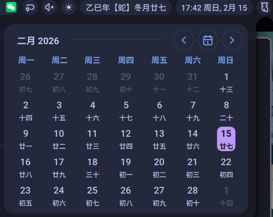

# Lunar Calendar Plugin

[English]\[[中文](./README_ZH.md)\]

A lunar calendar plugin for [Noctalia-Shell](https://github.com/noctalia-dev/noctalia-shell).

## Features

- **Bar Widget**: Display today's information in lunar calendar;
- **Panel**: A lunar calendar panel similar to the calendar of Noctalia-Shell. Add the information below the number of every day.

## Installation

- Add plugin source `https://github.com/xiaoyaoshengy/personal-noctalia-plugins` in `Settings >> Plugins >> Sources`, then fresh the plugin list, and install `lunar-calendar` plugin
- Or clone this folder to `~/.config/noctalia/plugins`

## Screenshots

## Acknowlegement

- [Noctalia-Shell](https://github.com/noctalia-dev/noctalia-shell)
- [mumuy/calendar](https://github.com/mumuy/calendar)
